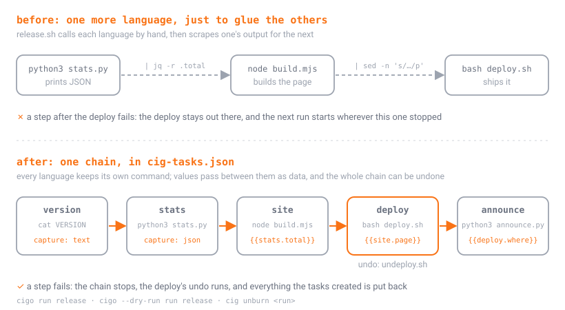
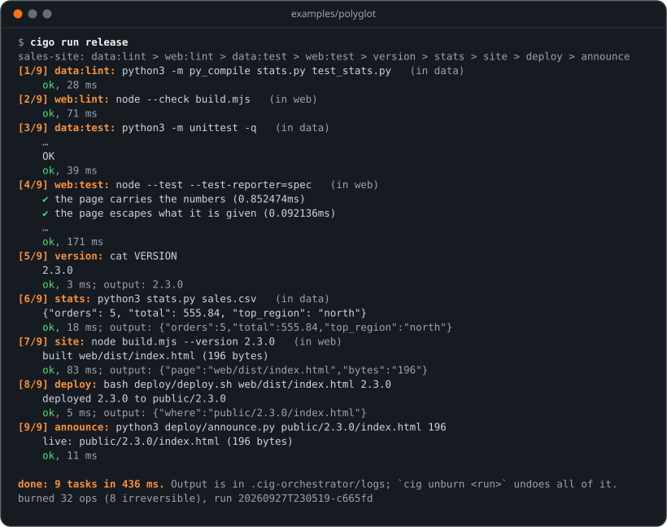
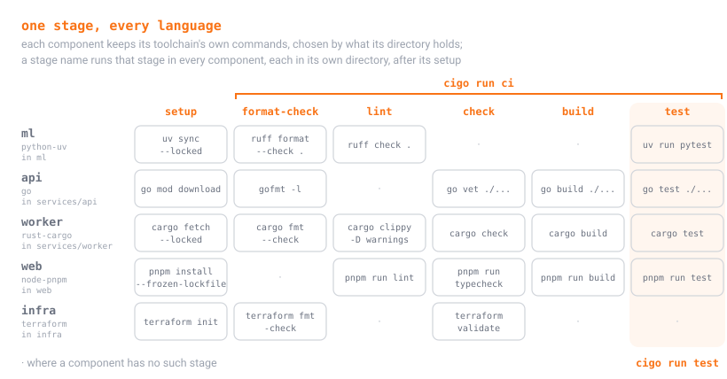

<p align="center">
  
</p>

<p align="center">
  <b>Every language in the project, one chain, no glue script.</b><br>
  <i>A tool from the maker of <a href="https://github.com/otmof-ops/CigScript">CigScript</a>, so you can start using it without starting over.</i>
</p>

<p align="center">
  <a href="https://github.com/otmof-ops/CigScript"></a>
  
  <a href="TOOLCHAINS.md"></a>
  <a href="docs/roadmap.md"></a>
  
</p>

Most projects are several languages in a row. A Python step makes the data,
a Go service and a Rust worker build on it, a TypeScript front end renders
it, and a bash script ships it. Each language brings its own tool (`uv`,
`go`, `cargo`, `pnpm`), and the chain between them ends up in one more
language: a `Makefile` or a `release.sh` whose only job is to call the
others in order, scrape one tool's output with `jq` for the next, and hope
nothing fails halfway.

**`cigo` is that glue, done once.** It knows the standard workflow of 60
toolchains, finds every language in your project, runs one stage across all
of them in dependency order, and hands values from one language to the next
as data. Your tools and scripts stay exactly as they are, and none of them
needs to know CigScript exists. The chain gets everything CigScript gives a
script: a dry run you can trust, rollback you never wrote, and an undo for
next week.

<p align="center"></p>

## Thirty seconds

```sh
cd your-project
cigo adopt                 # every language, task runner and script folder it finds
cigo adopt --write         # saved as cig-tasks.json; edit anything, it is yours
cigo check                 # loops, typos, missing tools and broken templates, before anything runs
cigo --dry-run run ci      # the whole plan, nothing executed
cigo run ci                # format-check, lint, check, build and test, in every language
cig unburn <run>           # changed your mind: everything back
```

[Getting started](docs/getting-started.md) walks through it on a real
project in five minutes, install included.

## See it run

[`examples/polyglot`](examples/polyglot) is three languages in one chain,
with nothing to install beyond Python 3 and Node 18. Python totals a CSV,
Node builds a page from those numbers, bash deploys it with an undo, and
Python reports where it went. Before any of that, each language's own lint
and tests run:

<p align="center"></p>

Nothing in that chain parses another program's output by hand. `stats`
captures Python's JSON, `site` reads `{{stats.total}}` from it, `build.mjs`
hands on the page's path by writing `page=...` to `$CIG_OUTPUT`, and bash
receives it as an argument. If `announce` had failed, the deploy's undo
would have run and the chain would have put back what it created.

## What you get

| what you get | how |
|---|---|
| one command per stage, every language | `cigo run test` runs `uv run pytest`, `go test`, `cargo test` and `pnpm run test`, each in its own directory |
| values across languages | Python's JSON becomes Node's environment and bash's arguments as `{{stats.total}}`, with no parsing in between |
| your scripts, as they are | `adopt` turns `scripts/`, Makefile targets, `package.json` scripts, justfile recipes and Taskfile tasks into tasks without touching them |
| a dry run | `cigo --dry-run run release` plans every task and executes none |
| rollback | the files your tasks create are journaled; when a later task fails, the run puts them back, newest first |
| an undo for next week | `cig unburn <run>` undoes a whole run that succeeded |
| an undo for what cig cannot see | a task's `undo` (a deploy's teardown, say) runs on rollback and on `cig unburn` |
| nothing done twice | a task with `inputs` is skipped while its files, and the values it was handed, are unchanged |
| checked first | `cigo check` finds loops, typos, unknown toolchains, missing programs and broken templates before anything runs |
| the tools themselves | `cigo doctor` finds each toolchain's tools and versions and compares them with the pins you already keep |

## One stage, every language

<p align="center"></p>

The commands are the ones each ecosystem documents: lockfile-respecting
installs (`--locked`, `--frozen-lockfile`, `npm ci`), the package manager the
lockfile or `packageManager` field names, the project's own `package.json`
scripts where it has them, and the formatter and linter it configures (Ruff
or Black, Biome or Prettier and ESLint, golangci-lint when it has a config).
[TOOLCHAINS.md](TOOLCHAINS.md) lists all 60: JavaScript and TypeScript,
Python, Rust, Go, the JVM, .NET, C and C++, Ruby, PHP, Elixir, Swift, Dart,
Zig, Haskell and more, plus Terraform, Docker, Helm and the task runners you
already have. Anything a project does differently is one line in its
manifest; [your own toolchains](docs/custom-toolchains.md) shows how.

## Guides

| guide | read it when you want to |
|---|---|
| [Getting started](docs/getting-started.md) | install cig and cigo, and run your first stage across a project |
| [Adopting a project](docs/adopting-a-project.md) | bring an existing repository over without rewriting anything |
| [Chaining languages](docs/chaining-languages.md) | pass values from one language to the next, with recipes for bash, Python, Node, Go, Rust, Ruby and PowerShell |
| [Coming from make, just, npm scripts and friends](docs/coming-from.md) | map what you already know onto cigo, and see what it adds and what it doesn't do |
| [The manifest](docs/manifest.md) | look up any key in `cig-tasks.json` |
| [Commands](docs/commands.md) | look up any command, flag, exit code or file cigo keeps |
| [Your own toolchains](docs/custom-toolchains.md) | change a built-in toolchain for your project, or teach cigo a new one |
| [cigo in CI](docs/ci.md) | run the same chain on GitHub Actions or GitLab CI |
| [Troubleshooting](docs/troubleshooting.md) | understand a message, or a task that won't run |
| [How it works](docs/how-it-works.md) | read the tool's insides before you change them |
| [Roadmap](docs/roadmap.md) | see what's coming, and how a request gets there |

## A note from the maker

I made CigScript because automation should respect your time and your
sanity. The fastest way to show a language is worth your time is to not ask
you to throw away the work you already have. So this tool takes the scripts,
the Makefile, the `package.json` and the toolchains you already use, and runs
them through CigScript exactly as they are.

It exists for two reasons. One is to take real work off your hands today.
The other is to show you that I care about making your work easier, by
making your tools do it the smarter way.

This is a serious project, and it is actively maintained:

- **Problems get fixed.** Report one and you get a fix, and a test that keeps
  it fixed.
- **More adoption tools are coming.** This is the first; the
  [roadmap](docs/roadmap.md) says what's next.
- **Quality-of-life requests are wanted.** If your other language or tool
  does something better, [tell me what it
  is](https://github.com/otmof-ops/cig-orchestrator/issues/new?template=qol-request.yml).
  I watch those requests, and the good ones land.
- **Ask for help, any time.** If you're bringing a project over and you're
  stuck, [open a guidance
  request](https://github.com/otmof-ops/cig-orchestrator/issues/new?template=guidance-request.yml)
  and I'll help you directly.

I want CigScript to be the best option for this work, and that only happens
one way: hardening it, and making it the choice that respects your time and
your sanity.

*Jay*

## Get help, ask for things, pitch in

| you want to | go here |
|---|---|
| get unstuck bringing a project over | [a guidance request](https://github.com/otmof-ops/cig-orchestrator/issues/new?template=guidance-request.yml) |
| have cigo know a language or tool it doesn't | [a toolchain request](https://github.com/otmof-ops/cig-orchestrator/issues/new?template=toolchain-request.yml) |
| get something your other tool does better | [a quality-of-life request](https://github.com/otmof-ops/cig-orchestrator/issues/new?template=qol-request.yml) |
| report something that went wrong | [a bug report](https://github.com/otmof-ops/cig-orchestrator/issues/new?template=bug-report.yml) |
| report a problem in the language itself | [CigScript's issues](https://github.com/otmof-ops/CigScript/issues) |
| report a security problem | [SECURITY.md](SECURITY.md), never a public issue |
| send a fix or a toolchain | [CONTRIBUTING.md](CONTRIBUTING.md) |

[SUPPORT.md](SUPPORT.md) says what happens after you ask.

## Install

Needs `cig` 1.1.1 or newer on `PATH` ([install CigScript](https://github.com/otmof-ops/CigScript#install)).

```sh
git clone https://github.com/otmof-ops/cig-orchestrator && cd cig-orchestrator
./install.sh      # orchestrate.cig into ~/.local/share/cig-orchestrator, cigo into ~/.local/bin
cigo version
```

`PREFIX=/opt/cig ./install.sh` installs elsewhere; `CIGO_NAME=orch ./install.sh`
names the command something else. Run `./install.sh` again after a `git pull`
to update. Without the launcher, the tool is one file:
`cig run path/to/orchestrate.cig -- run ci`.

## Limits, honestly

- A task's output is shown when the task finishes, not as it runs. Long
  builds are quiet until they are done.
- Tasks run one at a time.
- Files a task *creates* inside the project are undone; files it *modifies*
  or deletes are listed as irreversible, with the detail. What a task puts in
  `.git`, `node_modules` or `target` stays, and a setup that fills `.venv`
  with thousands of files takes longer under cig than outside it.
- With cig 1.1.1, directories a task creates are left behind, empty, after a
  rollback; the next CigScript release removes them too.
- The knowledge base holds each ecosystem's documented defaults. A build that
  needs an argument (an Xcode scheme, a Flutter platform, one solution out of
  several) says so in a stage override, and [TOOLCHAINS.md](TOOLCHAINS.md)
  notes which ones.

Each of these is on the [roadmap](docs/roadmap.md), and what building this
turned up in CigScript itself is in [FINDINGS.md](FINDINGS.md).

## Part of CigScript

cigo is written in CigScript, one file (`orchestrate.cig`), and it uses the
language the way you would: each command is a hop, the tasks are a chain
built at run time, the project is the pack, and a task's undo is a
compensation. CigScript itself, the lexicon, and the rules the kernel keeps
are at [otmof-ops/CigScript](https://github.com/otmof-ops/CigScript).
